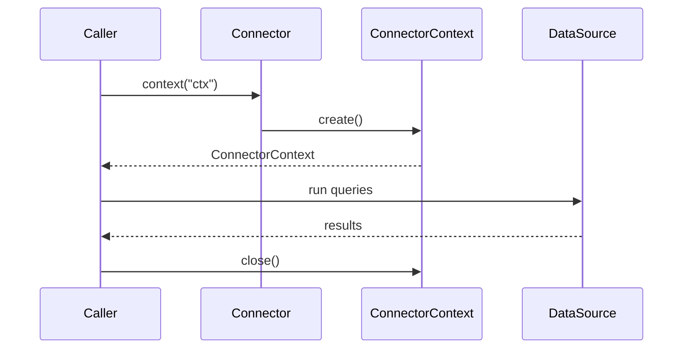

# JDAX Connection Architecture

This document describes how Connector, and ConnectorContext work together to provide
explicit, portable, and deterministic connection and transaction handling.

The design deliberately avoids container-managed transactions, `@Transactional`, and `ThreadLocal`
while remaining fully usable inside and outside Jakarta EE containers such as TomEE.

## Design goals

JDAX is built around the following goals:

- Manual control over `commit()` and `rollback()`
- Support for multiple DataSources in the same unit of work
- Deterministic connection lifecycle
- No dependency on JTA or container transaction managers
- No use of `ThreadLocal`
- Ability to run:
  - inside Jakarta EE
  - in unit tests
  - in CLI tools and batch jobs

## Core components

### ConnectorContext

`ConnectorContext` represents a unit of work.

Responsibilities:

- Owns all opened `Connection` instances
- Maps connections by DataSource name
- Controls transaction boundaries
- Performs cleanup and safety checks

Key characteristics:

- One `ConnectorContext` per unit of work
- One `Connection` per DataSource per context
- Explicit lifecycle: create -> use -> commit/rollback -> close

Typical responsibilities:

- Lazily open connections when first requested
- Track open vs closed connections
- Close all connections on completion
- Optionally force-close leaked connections

### ConnectorContext

`ConnectorContext` is a context holder, not a lifecycle manager.

Responsibilities:

- Hold a reference to the current `ConnectorContext`
- Make the active context accessible to static APIs
- Be explicitly set and cleared by the caller

Important notes:

- `ConnectorContext` does not create or manage connections
- It does not commit or rollback
- It does not use `ThreadLocal`

Think of it as a scoped registry:

```java
ConnectorContext.set(ConnectorContext);
// work happens here
ConnectorContext.clear();
````

The scope is controlled externally (interceptor, bootstrap code, test harness).

### Connector

`Connector` is the public entry point used by application code.

Responsibilities:

 Resolve the current `ConnectorContext`
 Delegate connection acquisition to the context
 Hide lifecycle complexity from business code

Key rule:

> `Connector.context(name)` always returns the context associated with the named unit of work.

Example:

```java
ConnectorContext cc = Connector.context("shoppingcart");
Connection c = cc.connection("ds-warehouse");
```

What actually happens:

1. `Connector` asks `ConnectorContext` for the current `ConnectorContext`
2. The context checks if a connection already exists for `"ds-warehouse"`
3. If not, it creates one from the configured DataSource
4. The same connection is reused for the rest of the unit of work

## Interaction overview

### High-level sequence



## Jakarta EE integration (interceptor-based)

In a Jakarta EE environment, an interceptor defines the unit-of-work boundary.

Typical interceptor responsibilities:

 Create a new `ConnectorContext`
 Bind it to `ConnectorContext`
 Invoke the intercepted method
 Commit or rollback
 Clear the context

Example (simplified):

```java
@AroundInvoke
public Object around(InvocationContext ic) throws Exception {
    try (ConnectorContext ctx = new Connector.context("ds")) {
        Object result = ic.proceed();
        ctx.commit();
        return result;
    } catch (Exception e) {
        ctx.rollback();
        throw e;
    } finally {
        Connector.detach("ds");
    }
}
```

Business code remains clean and unaware of lifecycle handling.

## Outside-container usage

The same model works without CDI or interceptors.

```java
try (ConnectorContext ctx = new Connector.context("modify")) {
    DAOType dao = new DAOType("ds-users", "modify");
    dao.update(...);
    ctx.commit();
} catch (Exception e) {
    ctx.rollback();
} finally {
    Connector.detach("modify");
}
```

This allows reuse of the same DAOs in:

 unit tests
 batch jobs
 command-line tools


## Force-close and leak protection

`ConnectorContext` may optionally support force-close functionality.

Purpose:

 Detect mismatched open/close counts
 Clean up leaked connections
 Attempt recovery when a pool is exhausted

Typical use cases:

 defensive cleanup in interceptors
 emergency cleanup by a higher-level manager
 diagnostics in test environments

Force-close is not the normal path and indicates a programming error upstream.


## Rules and invariants

JDAX enforces the following invariants:

 Connections are owned by `ConnectorContext`
 Application code must never close connections
 `Connector.connect()` must only be called when a context is active
 All contexts must be cleared in `finally` blocks

Violations are considered bugs.


## FAQ

### Why not `@Transactional`?

Because `@Transactional`:

 delegates control to the container
 hides commit and rollback boundaries
 makes multi-DataSource workflows opaque
 cannot be used outside a container

JDAX explicitly chooses clarity and control over convenience.


### Why not JTA?

JTA:

 requires a transaction manager
 complicates deployment
 introduces XA complexity
 is unnecessary for many applications

JDAX assumes that transaction boundaries are a business concern, not a container concern.


### Why not `ThreadLocal`?

`ThreadLocal`:

 breaks in async and reactive flows
 leaks across thread pools
 complicates testing
 hides dependencies

JDAX uses explicit scoping instead.
If you can’t see where a context is set and cleared, that’s a design smell.


### Why inject `ConnectorContext` at all?

You normally don’t.

 Application code uses `Connector`
 Infrastructure code controls `ConnectorContext`

This preserves separation of concerns:

 interceptors manage lifecycle
 business code focuses on logic


## Summary

JDAX’s connection model is:

 explicit
 portable
 deterministic
 container-agnostic

It trades hidden magic for clear structure, making it suitable for
long-lived systems where correctness and debuggability matter more than convenience.
